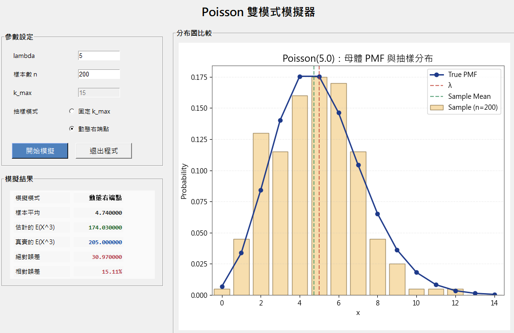

# 🎲 Poisson Random Variable Dual-Mode Simulator

> 使用 **Python + Tkinter + Matplotlib** 製作的互動式統計模擬專案，展示 **Poisson 隨機變數抽樣方法**，並比較兩種不同生成策略的效率與結果。


---

# ✨ 專案介紹

本專案以 **Poisson Random Variable Simulation** 為主題，設計一套完整桌面 GUI 系統，展示如何從均勻亂數產生：

$$
X \sim Poisson(\lambda)
$$

並比較兩種常見抽樣策略：

### 🔹 固定右端點法（Fixed k_max）
先建立有限 PMF 與 CDF，再進行反函數抽樣。

### 🔹 動態右端點法（Dynamic Right Endpoint）
逐步累加機率直到超過亂數門檻，自動決定樣本值。

---

# 🚀 專案特色

✅ GUI 互動式操作介面  
✅ 雙模式抽樣比較  
✅ Poisson 分布模擬  
✅ 理論 PMF vs 經驗分布比較  
✅ 樣本平均與母體平均比較  
✅ E(X^3) 誤差估計  
✅ 模組化架構設計

---

# 🖥️ GUI Preview

將截圖放入 `images/` 資料夾即可展示：

```md


```

### 主畫面


### 模擬結果


---

# 📂 專案結構

```text
hw3/
│── main.py
│── requirements.txt
│
└── modules/
    ├── config.py
    ├── gui.py
    ├── plot_utils.py
    ├── sampler.py
    ├── simulator.py
    └── stats_utils.py
```

---

# ⚙️ 安裝方式

```bash
git clone https://github.com/half-py/hw3.git
cd hw3
pip install -r requirements.txt
python main.py
```

---

# 🎯 抽樣模式一：固定 k_max

先截斷 Poisson 分布到：

$$
k=0,1,2,\dots,k_{max}
$$

建立：

$$
P(X=k)=e^{-\lambda}\frac{\lambda^k}{k!}
$$

再計算：

$$
F(k)=\sum_{j=0}^{k}P(X=j)
$$

## 📌 演算法步驟

1. 建立 PMF  
2. 遞推計算各項機率  
3. 建立 CDF  
4. 抽亂數 \(U\sim Uniform(0,1)\)  
5. 找最小 k 使 \(F(k)\ge U\)

---

# 🎯 抽樣模式二：動態右端點法

不先設定 k_max，而是逐步累加機率直到超過亂數門檻。

## 📌 演算法步驟

1. 產生亂數 \(U\sim Uniform(0,1)\)  
2. 從 \(k=0\) 開始  
3. 累加：

$$
p_0+p_1+\cdots+p_k
$$

4. 第一次超過 U 時停止，輸出 k

---

# 📊 視覺化圖表

系統會繪製：

- 經驗分布 Histogram  
- 理論 PMF 曲線  
- λ 垂直線  
- Sample Mean 線

---

# 📈 統計分析功能

### 樣本平均

$$
\bar X=\frac{1}{n}\sum X_i
$$

### 三次動差估計

$$
E(X^3)
$$

### Poisson 真值

$$
E(X^3)=\lambda^3+3\lambda^2+\lambda
$$

### 誤差分析

- Absolute Error
- Relative Error

---

# 📦 使用套件

- Python
- Tkinter
- Matplotlib

---

# 🎓 適合用途

✅ Probability / Statistics 作業  
✅ Poisson Distribution 教學  
✅ Simulation Methods 展示  
✅ Python GUI 作品集  
✅ GitHub 專案展示

---

# 🌟 專案亮點

這份專案不是直接呼叫套件，而是親自實作：

- PMF 遞推
- CDF inverse sampling
- Dynamic endpoint method
- GUI 視覺化
- 理論與模擬比較

代表真正理解隨機變數生成原理。

---

# 📬 Author

Made by **half-py**

GitHub: https://github.com/half-py/hw3
